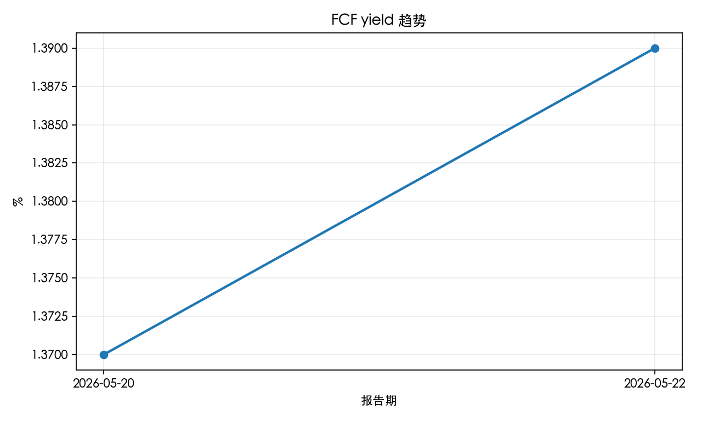

# Alphabet / Google AI 投资季度跟踪报告

- 生成日期：2026-05-23
- 覆盖对象：Alphabet Inc.（GOOG / GOOGL 需核实交易市场、股价、市值和股本口径后才能进入结论）
- 核心判断：待人工复核后再形成正式投资结论。
- 综合评分：68.8 / 100
- 系统动作建议：持有 / 不加仓（置信度：中；估值数据完整，真实交易仍须人工确认）
- 估值状态：估值数据完整

## 综合评分

| 维度 | 得分 | 状态 | 扣分或提示 |
| --- | ---: | --- | --- |
| Search 护城河 | 25.0 / 25 | 强 | Search 增速强；Google Services margin 代理显示利润质量强；搜索份额仍高 |
| Cloud 第二曲线 | 28.6 / 35 | 强 | Cloud 增速强；Cloud margin 强；Cloud backlog 原始增速强但口径变化，折扣计分 |
| AI ROI / FCF | 11.2 / 25 | 偏弱 | FCF margin 可用但受 CapEx 压制；CapEx/revenue 很高，压制 FCF；AI ROI 内部评分 55/100 |
| 估值与仓位 | 4.0 / 15 | 估值吸引力不足 | forward_pe: 估值偏高；fcf_yield_pct: 现金流收益率偏低；rr_ratio: R/R 低于 1 |

## 趋势图表

- Google Cloud 收入增速趋势：历史数据不足，暂不生成趋势图
- Google Cloud 经营利润率趋势：历史数据不足，暂不生成趋势图
- Search & Other 收入增速趋势：历史数据不足，暂不生成趋势图
- CapEx 与 FCF margin 对比：历史数据不足，暂不生成趋势图
### FCF yield 趋势

## Google I/O 2026 事件影响

- 状态：已核实；未进入买入/加仓结论
- 判断：I/O 强化了 Google 的全栈 AI 叙事：模型、Agent、TPU、Search 和订阅同时推进；当前应提高跟踪优先级，但不能替代估值和 FCF 证据。
- 结论纪律：I/O 事件事实不直接解锁买入、加仓、R/R 或仓位建议。

| 方向 | 关键事实 | 投资含义 |
| --- | --- | --- |
| 模型层 | Gemini 3.5 Flash / Pro / Omni | Flash 输出速度约为其他前沿模型的 4x，价格为可比前沿模型一半以下；Gemini 3.5 Pro 仍需下月发布核实；Omni Flash 已发布。 |
| Agent 生态 | Spark / Antigravity / Daily Brief | Spark、Antigravity 2.0、Managed Agents 和 Daily Brief 已由官方公告核实，商业化仍需验证付费转化。 |
| 基础设施 | CapEx $180 bn - $190 bn | TPU 8t 原始算力约 3x，可跨 1.0 million+ TPUs 分布式训练；这是 Cloud/AI 护城河证据，也会加重 FCF 压力。 |
| 产品渗透 | AI Mode 1.0 billion monthly active users；Gemini App 900 million monthly active users | AI Overviews 2.5 billion monthly active users，Gemini App 日请求同比约 7x YoY；需跟踪 Search 广告 monetization。 |
| 商业化 | AI Ultra $100/month | 订阅层级和企业成本优势是正向线索，但还没有用户数、留存、毛利和 FCF 兑现数据。 |

### 后续跟踪

- Gemini 3.5 Pro 下月是否按期发布，以及外部基准是否确认竞争力。
- AI Mode / AI Overviews 是否保护 Search 查询量和广告变现。
- AI Ultra、Spark、Antigravity 是否披露付费用户、留存或企业采用。
- 1800-1900 亿美元 capex 是否继续挤压 FCF，Cloud 收入和利润能否对冲。
- TPU 8t/8i 是否带来 Cloud 外部客户收入、毛利率或单位成本改善。

## 投行与共识目标价

- 状态：已录入；仅作外部估值参考
- 摘要：公开可核实样本 11 条，目标价区间 $375-$460，样本中位数约 $429。二手新闻和聚合数据不能替代自有估值模型。
- 外部基准参考：429
- 外部风险参考：375
- 外部乐观参考：460
- 结论纪律：二手新闻和聚合目标价只作为外部参考，不直接写入 valuation_snapshot.csv，不自动解锁 R/R。

| 机构 | 评级 | 动作 | 目标价 | 前值 | 来源 | 日期 | 备注 |
| --- | --- | --- | ---: | ---: | --- | --- | --- |
| StockAnalysis / S&P Global consensus | Strong Buy | Consensus | 428.96 | 数据缺失 | StockAnalysis | 2026-05-20 | 公开聚合数据；可作外部共识参考，不等同投行原始研报 |
| Benzinga consensus | Buy | Consensus | 408.49 | 数据缺失 | Benzinga | 2026-05-20 | 公开聚合数据；与 StockAnalysis 样本数不同，需保留口径差异 |
| Goldman Sachs | Buy | Raised | 450 | 400 | Investing.com / Reuters | 2026-04-30 | 引用公开新闻摘要；原始 Goldman 研报未取得；理由包括 Search reacceleration、Cloud backlog、Cloud incremental margin 和 capex ROI 关注 |
| JPMorgan Chase & Co. | Overweight | Raised | 460 | 395 | MarketBeat / MarketScreener | 2026-04-30 | 引用公开新闻摘要；原始 JPMorgan 研报未取得 |
| Bank of America | Buy | Raised | 430 | 370 | MarketBeat / MarketScreener | 2026-05-01 | 引用公开新闻摘要；原始 BofA 研报未取得；关注 AI spending tailwinds 和 Cloud |
| Morgan Stanley | Overweight | Raised | 375 | 330 | MarketBeat / Benzinga | 2026-04-30 | 引用公开新闻摘要；原始 Morgan Stanley 研报未取得；该目标价低于新闻当时价格 |
| Piper Sandler | Overweight | Raised | 425 | 395 | StreetInsider | 2026-04-30 | 引用公开新闻摘要；原始 Piper Sandler 研报未取得；观点强调 Cloud 与 Search 同时强劲 |
| Benzinga consensus | Buy | Consensus | 408.71 | 数据缺失 | Benzinga | 2026-05-22 | Benzinga 显示共识目标价 408.71、最高 515、最低 310；二手聚合，仅作外部共识参考 |
| Recent Benzinga sample | Mixed | Recent ratings average | 444.33 | 数据缺失 | Benzinga | 2026-05-22 | 最近三家目标价均值；样本小、偏事件反馈，不能替代基准估值 |
| TD Cowen | Buy | Reiterated | 450 | 数据缺失 | Investing.com / Reuters | 2026-05-21 | I/O 后维持 Buy；引用公开新闻摘要，原始 TD Cowen 研报未取得 |
| Stifel | Buy | Reiterated | 420 | 数据缺失 | Investing.com | 2026-05-20 | I/O 后维持 Buy；称 Alphabet AI 竞争位置改善；原始 Stifel 研报未取得 |

## 四个框架判断

| 框架 | 当前判断 | 需要补充的证据 |
| --- | --- | --- |
| Goldman | Cloud 增速和 margin 已核实为强信号，但估值快照缺失，不能确认重估空间 | 当前价格、PE、FCF yield、R/R |
| Damodaran | 经营数字可进入模型，但缺少市场价格和股本/市值快照，暂不能做完整估值 | 当前价格、市值、股本、资本成本、终值假设 |
| Dan Niles | AI capex 压力已可见，FCF 仍需连续跟踪；估值缺失导致无法判断是否过热 | CapEx 指引、FCF、估值扩张、Cloud 降速风险 |
| Ackman/Berkshire | Search 与 Cloud 质量信号较强，但买入价和长期 R/R 尚未核实 | 合理买入价、FCF yield、回购纪律、监管风险 |

## 情景与概率

| 情景 | 概率 | 判断 | 触发条件 |
| --- | ---: | --- | --- |
| 基准 | 50% | 继续跟踪，等待估值快照补齐 | 价格、PE、FCF yield、来源和抓取日期完整 |
| 乐观 | 25% | Search 稳定、Cloud 利润率改善、AI 投入转化为 FCF 增量 | 云收入和利润率超预期，AI 产品提升商业化，FCF 质量改善 |
| 风险 | 25% | AI capex 回报不清、监管压力或广告增长放缓压低估值 | FCF 走弱、capex 上修、反垄断处罚或搜索份额明显下滑 |

## 触发条件

| 动作 | 条件 |
| --- | --- |
| 加仓 | 估值数据、来源和日期完整，R/R 不低于 1.5，且 Cloud 与 Search 指标继续高于阈值 |
| 减仓 | Cloud 增速低于合格线、Cloud margin 回落、Search 增速弱化，或估值与增长质量不匹配 |
| 退出 | Search 护城河受损、Cloud 增速低于危险线、FCF 持续恶化或监管永久削弱商业模式 |

## 估值快照

| 字段 | 当前值 |
| --- | --- |
| date | 2026-05-22 |
| ticker | GOOGL |
| current_price | 382.97 |
| target_price_base | 428.96 |
| downside_price | 334.22 |
| upside_pct | 12.0% |
| downside_pct | 12.7% |
| rr_ratio | 0.94 |
| market_cap_usd_bn | 4640.06 |
| diluted_shares_bn | 数据缺失 |
| pe_ratio | 29.21 |
| fcf_yield_pct | 1.39 |
| ev_to_fcf | 数据缺失 |
| net_cash_usd_bn | 数据缺失 |
| source_url | https://www.marketbeat.com/stocks/NASDAQ/GOOGL/forecast/ |
| source_date | 2026-05-22 |
| captured_at | 2026-05-23 |
| valuation_methodology | I/O 后保守复核法：current_price 使用 MarketBeat 与 Benzinga 交叉显示的 2026-05-22 GOOGL 收盘价 382.97；market_cap 与 PE 按 2026-05-20 快照比例近似更新；target_price_base 暂沿用已录入公共样本中位附近 428.96，不因单一 I/O 后研报上调；downside_price 沿用 334.22；FCF yield=2026Q1 官方 TTM FCF 64.429bn / 估算市值 4640.06bn = 1.39%。目标价和下行价为外部参考与模型假设，不是已验证事实。 |
| 时效 | 未过期 |
| notes | I/O 2026 产品反馈强，但尚未形成广告变现、订阅付费、Cloud/Agent 收入和 FCF 增量的官方财务证据；真实买入/卖出仍需用户人工确认 |

## R/R 与仓位资格

- R/R 状态：已解锁，仍需人工确认真实交易动作。
- 上行空间：12.0%。
- 下行空间：12.7%。
- R/R：0.94。
- 计算口径：上行=(基准目标价 428.96 - 当前价格 382.97) / 当前价格；下行=(当前价格 382.97 - 风险下行价 334.22) / 当前价格；R/R=上行空间/下行空间。
- 估值方法：I/O 后保守复核法：current_price 使用 MarketBeat 与 Benzinga 交叉显示的 2026-05-22 GOOGL 收盘价 382.97；market_cap 与 PE 按 2026-05-20 快照比例近似更新；target_price_base 暂沿用已录入公共样本中位附近 428.96，不因单一 I/O 后研报上调；downside_price 沿用 334.22；FCF yield=2026Q1 官方 TTM FCF 64.429bn / 估算市值 4640.06bn = 1.39%。目标价和下行价为外部参考与模型假设，不是已验证事实。。目标价区间为模型假设，不是已验证事实。

## 价格敏感性与动作区间

- 摘要：R/R >= 1.5 的复核买入价约为 $372.12 以下；$381.59 以上 R/R 低于 1；$397.38 以上进入减仓复盘区。
- 买入复核区：$372.12 以下
- 持有区间：$372.12 - $397.38
- 减仓复盘区：$397.38 以上
- 计算口径：基准目标价 $428.96、风险下行价 $334.22 沿用 valuation_snapshot.csv；上行=(基准目标价-假设价格)/假设价格；下行=(假设价格-风险下行价)/假设价格；R/R=上行/下行。目标价和下行价为模型假设，不是已验证事实。

| 假设股价 | 上行空间 | 下行空间 | R/R | 动作区间 | 备注 |
| ---: | ---: | ---: | ---: | --- | --- |
| $334.22 | 28.3% | 0.0% | 数据缺失 | 风险价以下 / 先复核 | 价格低于风险情景，下行假设可能需要重估，不自动加仓。 |
| $350.00 | 22.6% | 4.5% | 5.02 | 可买入复核 | R/R 达到 1.5 门槛；仍需确认 Search、Cloud、FCF 和监管风险未恶化。 |
| $370.00 | 15.9% | 9.7% | 1.64 | 可买入复核 | R/R 达到 1.5 门槛；仍需确认 Search、Cloud、FCF 和监管风险未恶化。 |
| $372.12 | 15.3% | 10.2% | 1.50 | 可买入复核 | R/R 达到 1.5 门槛；仍需确认 Search、Cloud、FCF 和监管风险未恶化。 |
| $381.59 | 12.4% | 12.4% | 1.00 | 持有 / 等待 | R/R 在 1.0-1.5，估值有边际但未达到加仓门槛。 |
| $382.97 | 12.0% | 12.7% | 0.94 | 持有 / 不加仓 | R/R 低于 1，当前价格对目标价和下行价不够有利。 |
| $397.38 | 7.9% | 15.9% | 0.50 | 减仓复盘 | R/R 低于 0.5，需复核仓位、目标价和新增证据。 |
| $415.00 | 3.4% | 19.5% | 0.17 | 减仓复盘 | R/R 低于 0.5，需复核仓位、目标价和新增证据。 |
| $428.96 | 0.0% | 22.1% | 0.00 | 减仓复盘 | R/R 低于 0.5，需复核仓位、目标价和新增证据。 |

## 估值情景矩阵

- 摘要：当前价 $382.97：风险情景进入减仓复盘区、乐观情景达到买入复核区，分歧较大；基准情景仍是核心锚点，不支持直接加仓。
- 结论纪律：情景目标价和下行价是模型假设或外部参考衍生，不是已验证事实；矩阵只用于复核当前持有结论是否稳健。

| 情景 | 概率 | 目标价 | 下行价 | 买入复核价 | R/R=1 价格 | 减仓复盘价 | 当前价 R/R | 当前动作 | 来源日期 |
| --- | ---: | ---: | ---: | ---: | ---: | ---: | ---: | --- | --- |
| 风险 | 25% | $360.00 | $300.00 | $324.00 | $330.00 | $340.00 | -0.28 | 减仓复盘 | 2026-05-20 |
| 基准 | 50% | $428.96 | $334.22 | $372.12 | $381.59 | $397.38 | 0.94 | 持有 / 不加仓 | 2026-05-20 |
| 乐观 | 25% | $475.00 | $350.00 | $400.00 | $412.50 | $433.33 | 2.79 | 可买入复核 | 2026-05-20 |

### 情景口径

- 风险：风险情景为内部模型假设：在公开聚合目标价低位 334.22 附近下修下行价至 300，并将目标价设为 360，用于压力测试当前持有结论；不是已验证事实。
- 基准：基准情景沿用 valuation_snapshot.csv：目标价采用 StockAnalysis / S&P Global 64 位分析师平均目标价 428.96；下行价采用同一公开聚合样本低位 334.22；目标价和下行价为外部参考与模型假设。
- 乐观：乐观情景为内部模型假设：在外部聚合样本高位附近上修目标价至 475，下行价设为 350，用于检验 Cloud/AI 兑现时的上行弹性；不是已验证事实。

## 风险信号

- Search 份额或商业化效率下滑。
- Cloud 增长放缓或经营利润率回落。
- AI 资本开支上升但收入和 FCF 转化不清晰。
- 估值吸引力不足：R/R 0.94 低于 1，当前不具备加仓吸引力。
- 反垄断、数据隐私、默认搜索协议等监管风险扩大。
- 回购价格纪律变差或股本口径不清。

## 下季度跟踪清单

- Alphabet 官方财报、10-Q、IR 材料和业绩会纪要。
- Search 收入增长、利润率、流量获取成本和份额变化。
- Google Cloud 收入增长、经营利润、积压订单或等效指标。
- AI capex、折旧、FCF、AI 产品商业化证据。
- 最新股价、市值、股本、回购、估值倍数和 R/R。

## 数据来源与核实状态

| 指标 | 数值 | 单位 | 报告期 | 来源 | 发布日期 | 抓取日期 | 口径 | 核实状态 | 时效 | 备注 |
| --- | ---: | --- | --- | --- | --- | --- | --- | --- | --- | --- |
| search_revenue_growth_yoy_pct | 19 | % | 2026Q1 | Alphabet Q1 2026 earnings release | 2026-04-29 | 2026-05-18 | Google Services 分项披露：Google Search & other revenue growth YoY | 已核实 | 未过期 | 官方公告披露 Search & other 增长 19% |
| search_operating_margin_pct | 45.3 | % | 2026Q1 | Alphabet Q1 2026 earnings release | 2026-04-29 | 2026-05-21 | Google Services operating income 40.589bn / Google Services revenue 89.637bn；作为 Search 利润质量代理，非 Search 单独披露 margin | 已核实 | 未过期 | 代理指标；Alphabet 不披露 Search operating margin，使用 Google Services margin 作为保守代理 |
| search_market_share_pct | 90.04 | % | 2026-04 | StatCounter Global Stats | 2026-04-30 | 2026-05-21 | StatCounter worldwide search engine market share April 2026 | 已核实 | 未过期 | 第三方份额数据；作为 Search 护城河辅助证据 |
| cloud_revenue_growth_yoy_pct | 63 | % | 2026Q1 | Alphabet Q1 2026 earnings release | 2026-04-29 | 2026-05-18 | Google Cloud revenue growth YoY | 已核实 | 未过期 | 官方公告披露 Google Cloud revenues increased 63% |
| cloud_operating_margin_pct | 32.9 | % | 2026Q1 | Alphabet Q1 2026 earnings release | 2026-04-29 | 2026-05-18 | Google Cloud operating income 6.598bn / Google Cloud revenue 20.028bn | 已核实 | 未过期 | 由官方分部收入和分部经营利润计算 |
| cloud_backlog_growth_yoy_pct | 400.3 | % | 2026Q1 | Alphabet Form 10-Q | 2026-04-30 | 2026-05-21 | 原始同比=(2026Q1 Google Cloud backlog 462.3bn - 2025Q1 revenue backlog 92.4bn)/92.4bn；2026Q1 口径变化导致不可完全可比 | 已核实 | 未过期 | 口径变化：2026Q1 起 backlog 纳入原始预期期限一年及以内合同；原始同比不得解释为纯订单加速 |
| fcf_margin_pct | 9.2 | % | 2026Q1 | Alphabet Q1 2026 earnings release | 2026-04-29 | 2026-05-18 | Free cash flow 10.116bn / total revenues 109.896bn | 已核实 | 未过期 | 由官方 FCF 和收入计算 |
| capex_to_revenue_pct | 32.5 | % | 2026Q1 | Alphabet Q1 2026 earnings release | 2026-04-29 | 2026-05-18 | Purchases of property and equipment 35.674bn / total revenues 109.896bn | 已核实 | 未过期 | 由官方 CapEx 和收入计算 |
| ai_capex_roi_comment_score | 55 | 0-100 | 2026Q1 | Alphabet Q1 2026 earnings release + Google I/O 2026 official announcements | 2026-05-19 | 2026-05-21 | 内部评分：I/O 使用量、Gemini/Agent/TPU 进展和 Cloud 增长为正；CapEx/revenue 32.5%、FCF margin 9.2%、2026 capex guide 180-190bn 为负 | 已核实 | 未过期 | 模型评分，不是公司披露事实；用于 AI ROI/FCF 维度的保守中性偏正评分 |
| forward_pe | 数据缺失 | x | 2026Q1 | 数据缺失 | 数据缺失 | 数据缺失 | 数据缺失 | 待核实 | 数据缺失 | 待核实样例 |
| fcf_yield_pct | 数据缺失 | % | 2026Q1 | 数据缺失 | 数据缺失 | 数据缺失 | 数据缺失 | 待核实 | 数据缺失 | 待核实样例 |
| rr_ratio | 数据缺失 | x | 2026Q1 | 数据缺失 | 数据缺失 | 数据缺失 | 数据缺失 | 待核实 | 数据缺失 | 待核实样例 |
| forward_pe | 29.21 | x | 2026-05-22 | valuation_snapshot.csv / analyst_snapshot.csv | 2026-05-22 | 2026-05-23 | I/O 后保守复核法：current_price 使用 MarketBeat 与 Benzinga 交叉显示的 2026-05-22 GOOGL 收盘价 382.97；market_cap 与 PE 按 2026-05-20 快照比例近似更新；target_price_base 暂沿用已录入公共样本中位附近 428.96，不因单一 I/O 后研报上调；downside_price 沿用 334.22；FCF yield=2026Q1 官方 TTM FCF 64.429bn / 估算市值 4640.06bn = 1.39%。目标价和下行价为外部参考与模型假设，不是已验证事实。 | 已核实 | 未过期 | 由估值快照派生；目标价和下行价为模型假设，不是已验证事实 |
| fcf_yield_pct | 1.39 | % | 2026-05-22 | valuation_snapshot.csv / analyst_snapshot.csv | 2026-05-22 | 2026-05-23 | I/O 后保守复核法：current_price 使用 MarketBeat 与 Benzinga 交叉显示的 2026-05-22 GOOGL 收盘价 382.97；market_cap 与 PE 按 2026-05-20 快照比例近似更新；target_price_base 暂沿用已录入公共样本中位附近 428.96，不因单一 I/O 后研报上调；downside_price 沿用 334.22；FCF yield=2026Q1 官方 TTM FCF 64.429bn / 估算市值 4640.06bn = 1.39%。目标价和下行价为外部参考与模型假设，不是已验证事实。 | 已核实 | 未过期 | 由估值快照派生；目标价和下行价为模型假设，不是已验证事实 |
| rr_ratio | 0.94 | x | 2026-05-22 | valuation_snapshot.csv / analyst_snapshot.csv | 2026-05-22 | 2026-05-23 | I/O 后保守复核法：current_price 使用 MarketBeat 与 Benzinga 交叉显示的 2026-05-22 GOOGL 收盘价 382.97；market_cap 与 PE 按 2026-05-20 快照比例近似更新；target_price_base 暂沿用已录入公共样本中位附近 428.96，不因单一 I/O 后研报上调；downside_price 沿用 334.22；FCF yield=2026Q1 官方 TTM FCF 64.429bn / 估算市值 4640.06bn = 1.39%。目标价和下行价为外部参考与模型假设，不是已验证事实。 | 已核实 | 未过期 | 由估值快照派生；目标价和下行价为模型假设，不是已验证事实 |

## 决策日志字段

| 字段 | 当前值 |
| --- | --- |
| 日期 | 2026-05-23 |
| 标的 | Alphabet Inc. |
| 当前价格或估值 | 382.97 |
| 当前判断 | 待人工复核后再形成正式投资结论。 |
| 建议动作 | 持有 / 不加仓，但估值数据完整，真实交易仍须人工确认 |
| 概率 | 基准 50%，乐观 25%，风险 25% |
| 核心证据 | Search & other 增长 19%（Alphabet Q1 2026 earnings release，2026-04-29）；Cloud 收入增长 63%（Alphabet Q1 2026 earnings release，2026-04-29）；Cloud operating margin 32.9%（Alphabet Q1 2026 earnings release，2026-04-29）；FCF margin 9.2%（Alphabet Q1 2026 earnings release，2026-04-29）；CapEx / revenue 32.5%（Alphabet Q1 2026 earnings release，2026-04-29） |
| 反方证据 | R/R 低于 1（当前 0.94）；FCF yield 偏低（当前 1.39%）；PE 偏高（当前 29.21x）；AI CapEx ROI 仍需后续财报验证；监管、竞争和 Search AI monetization 风险仍需跟踪 |
| 关键假设 | Search 护城河、Cloud 利润率、AI ROI 和估值口径均待继续验证 |
| 触发条件 | 见上方加仓、减仓、退出触发条件 |
| 止损或退出条件 | 护城河受损、FCF 恶化、监管永久削弱商业模式 |
| 下次复盘日期 | 下季度财报发布后 5 个工作日内 |
| 后续实际结果 | 待记录 |

## 决策日志待写入字段

| 字段 | 当前值 |
| --- | --- |
| run_id | 2026-05-23|2026Q1|GOOGL|持有 / 不加仓|68.8 |
| generated_at | 2026-05-23T20:53:14 |
| date | 2026-05-23 |
| period | 2026Q1 |
| ticker | GOOGL |
| current_price | 382.97 |
| score | 68.8 |
| action | 持有 / 不加仓 |
| confidence | 中 |
| key_evidence | Search & other 增长 19%（Alphabet Q1 2026 earnings release，2026-04-29）；Cloud 收入增长 63%（Alphabet Q1 2026 earnings release，2026-04-29）；Cloud operating margin 32.9%（Alphabet Q1 2026 earnings release，2026-04-29）；FCF margin 9.2%（Alphabet Q1 2026 earnings release，2026-04-29）；CapEx / revenue 32.5%（Alphabet Q1 2026 earnings release，2026-04-29） |
| contrary_evidence | R/R 低于 1（当前 0.94）；FCF yield 偏低（当前 1.39%）；PE 偏高（当前 29.21x）；AI CapEx ROI 仍需后续财报验证；监管、竞争和 Search AI monetization 风险仍需跟踪 |
| add_trigger | 估值数据、来源和日期完整，R/R 不低于 1.5，且 Cloud 与 Search 指标继续高于阈值 |
| reduce_trigger | Cloud 增速低于合格线、Cloud margin 回落、Search 增速弱化，或估值与增长质量不匹配 |
| exit_trigger | Search 护城河受损、Cloud 增速低于危险线、FCF 持续恶化或监管永久削弱商业模式 |
| next_review_date | 下季度财报发布后 5 个工作日内 |
| change_reason | 数据缺失 |
